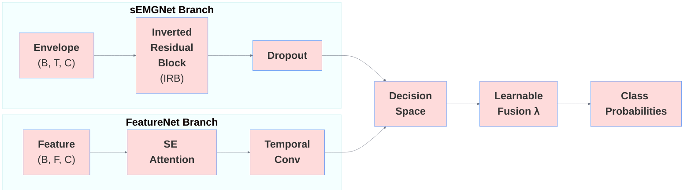
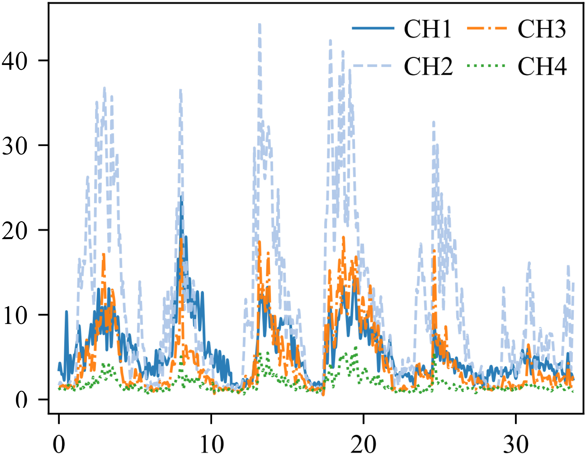
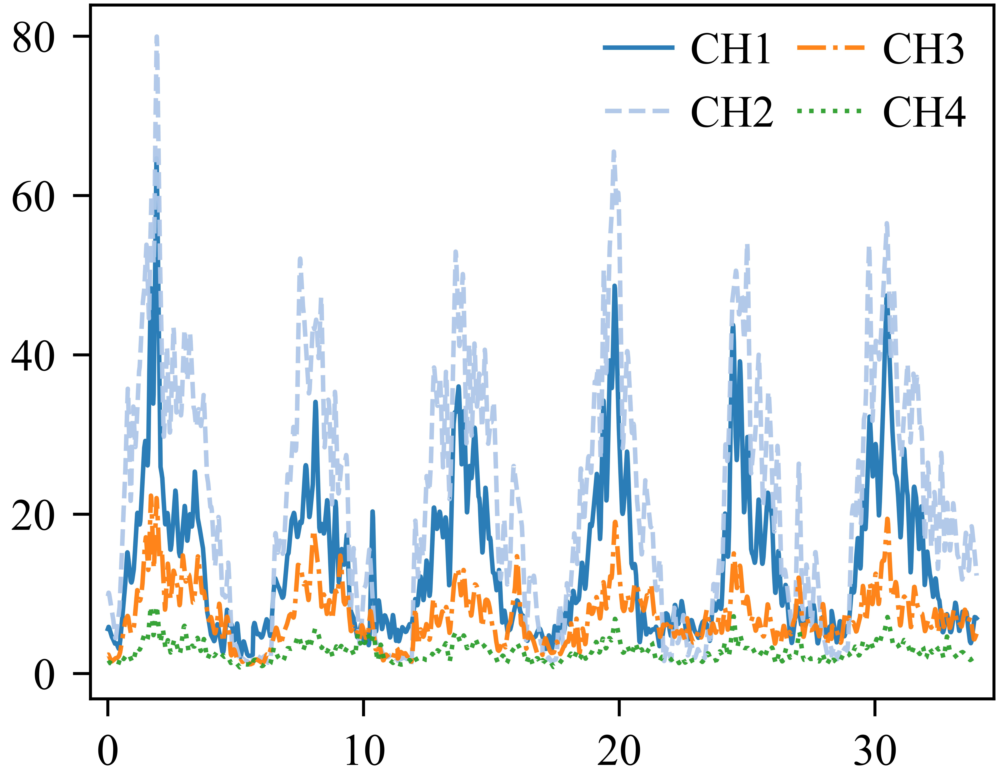

# DFDFNet: Dual-Stream Dynamic Fusion Network for sEMG Gesture Recognition

## Brief
This repository presents a clean version of DFDFNet, distilled by the authors from our related work, focusing on the core content of the DFDFNet study. It is implemented on TensorFlow 2 / Keras 3 and provides a full training and evaluation pipeline (data preprocessing, model configurations, hyperparameters, and evaluation scripts) that is easy to run and reproduce. To facilitate one-click reproduction, this release includes a partial example dataset (DB2), a pretrained model together with its results, and Jupyter notebook code along with the corresponding outputs.

---

## 📑 Table of Contents

- [DFDFNet: Dual-Stream Dynamic Fusion Network for sEMG Gesture Recognition](#dfdfnet-dual-stream-dynamic-fusion-network-for-semg-gesture-recognition)
  - [Brief](#brief)
  - [📑 Table of Contents](#-table-of-contents)
  - [🧠 Model Description](#-model-description)
    - [🏗️ Network Architecture](#️-network-architecture)
    - [🧩 Key Modules](#-key-modules)
  - [📁 Directory Structure](#-directory-structure)
  - [⚙️ Environment Requirements](#️-environment-requirements)
  - [📊 Data Preparation](#-data-preparation)
  - [🚀 Quick Start](#-quick-start)
  - [🛠️ Command-Line Arguments](#️-command-line-arguments)
  - [📈 Outputs](#-outputs)
  - [📚 Citation](#-citation)
  - [📧 Contact](#-contact)
  - [📄 License](#-license)

---
## 🧠 Model Description

### 🏗️ Network Architecture
**DFDFNet** (**D**ual-stream **F**eature **D**ynamic **F**usion **Net**work) is a lightweight dual-stream network proposed for NinaPro surface electromyography (sEMG) gesture recognition. 

The model takes two inputs simultaneously:

- **Envelope branch (sEMGNet)**: the raw temporal signal after envelope rectification;
- **Feature branch (FeatureNet)**: a hand-crafted sEMG feature set.




The features of the two branches are dynamically weighted and concatenated via a **learnable fusion weight**, then passed through an inverted residual block and a feed-forward classification head to produce gesture class probabilities, achieving excellent accuracy while remaining lightweight.

### 🧩 Key Modules

- **InvertedResidualBlock**: pointwise expansion → depthwise separable convolution →
  pointwise projection, integrating squeeze-and-excitation attention and spectral
  normalization;
- **SqueezeExcitation**: channel attention that adaptively recalibrates feature channels;
- **TemporalConvBlock**: stacked 1D temporal convolutions;
- **LearnableFusion**: dynamically weights and concatenates the two branches with a trainable scalar $λ_s$.

## 📁 Directory Structure

```
DFDFNet_Release/
├── launch.py                # Top-level training entry point
├── requirements.txt         # Dependency list
├── Data/                    # Dataset files (DB2 reference example)
├── Images/                  # Architecture figures
├── models/                  # Training outputs
├── DFDFNet_Utils/
│   ├── __init__.py          # Package exports
│   ├── __main__.py          # python -m DFDFNet_Utils entry point
│   ├── cli.py               # Command-line argument parsing
│   ├── config.py            # Training / data / model configuration (dataclass)
│   ├── utils.py             # Random seed, logging, environment info
│   ├── losses.py            # Loss functions (including Margin Loss)
│   ├── blocks.py            # Reusable network building blocks
│   ├── model.py             # DFDFNet model
│   ├── data.py              # Data loading and splitting
│   ├── callbacks.py         # Training callbacks and checkpoint resume
│   ├── training.py          # Trainer
│   ├── evaluation.py        # Evaluation metrics
│   └── pipeline.py          # End-to-end pipeline orchestration
```

## ⚙️ Environment Requirements

- Python ≥ 3.10
- TensorFlow ≥ 2.15
- NumPy / pandas / scikit-learn / scipy / matplotlib / seaborn

```bash
pip install -r requirements.txt
```

## 📊 Data Preparation

The data directory must follow the layout below (consistent with the Ninapro
preprocessing output):

```
Data/
└── DB2/
    ├── DB2_Envelope/
    │   └── Results_200ms/Ninapro_Data_S1_A1_E123/data_npy.npy   # Envelope signal (samples, time, channels)
    └── DB2_Feature/
        └── Results_200ms/Ninapro_Data_S1_A1_E123/data_npy.npy   # Feature set (samples, features, channels)
```
<div align="center">
  
  
</div>

## 🚀 Quick Start
The training pipeline can be launched in three ways:

1. **Cloud Colab Notebook** — upload and run [`ColabPro_Training.ipynb`](ColabPro_Training.ipynb) in Google Colab (Pro recommended) for GPU-accelerated training in the cloud.

2. **Local Notebook** — open [`Local_Training (Not Recommend).ipynb`](Local_Training%20(Not%20Recommend).ipynb) and run it in a local Jupyter / VS Code environment. The notebook auto-detects its own directory, performs a path-mismatch check, and forwards all arguments to `launch.py`.
   
3. **Command line** — run the entry script directly from a terminal:

    ```bash
    # Default configuration (DB2, all 49 gestures, subject S1, Repeat split)
    python launch.py

    # Specify gesture subset and fusion weight
    python launch.py -db DB2 -ex A -fw 0.5 -fm 2

    # Adjust training hyper-parameters
    python launch.py -ep 300 -ba 256 -lr 0.0005

    # Resume from checkpoint
    python launch.py -irm

    # Launch as a module (No Use)
    # python -m DFDFNet_Utils -db DB2 -ex All
    ```


## 🛠️ Command-Line Arguments

| Argument | Default | Description |
| --- | --- | --- |
| `-mn/--model-name` | `DFDFNet` | Model name |
| `-fw/--fusion-weight` | `0.5` | Fusion weight (0=feature branch, 1=envelope branch, otherwise=dual-branch fusion) |
| `-fm/--fusion-mode` | `1` | Fusion mode (1=decision fusion) |
| `-db/--database` | `DB2` | Dataset name (only DB2 is provided as a reference example) |
| `-ex/--exercise` | `All` | Gesture subset (A/B/C/All) |
| `-su/--subject-list` | `[1]` | Subject list |
| `-wi/--window-length` | `200` | Window length (ms) |
| `-tsm/--train-split-method` | `Repeat` | Split method (Random/Repeat/FoldK) |
| `-ep/--epochs` | `200` | Maximum number of epochs |
| `-ba/--batch-size` | `320` | Batch size |
| `-lr/--learning-rate` | `1e-3` | Initial learning rate |
| `-lo/--loss` | `margin` | Loss function |
| `-irm/--reload-checkpoint` | `False` | Whether to resume from checkpoint |


## 📈 Outputs

Training results are saved under `models/<model_name>/`:

```
models/DFDFNet-S1-DB2_Fusion-sEMG_Percent50-200ms-49-Repeat/
├── checkpoints/        # Best weights
├── history/            # Training history CSV
├── info/               # Configuration JSON
├── model/              # Full model .keras
├── result/             # Evaluation report / confusion matrix / ROC-AUC
└── structure/          # Model structure
```

## 📚 Citation

If you find this work useful in your research, please cite our **paper**: [Dual-Stream Feature-Map Dynamic Fusion Network for Multiclass sEMG Gesture Recognition](https://doi.org/)

## 📧 Contact

For questions about this repository, please contact:

- **Author**: Hang Yu
- **Affiliation**: Beihang University (BUAA)
- **Email**: [transover@buaa.edu.cn](mailto:transover@buaa.edu.cn) or [yuhang7108290@gmail.com](mailto:yuhang7108290@buaa.edu.cn)

## 📄 License

This repository is licensed under the MIT License and is intended for academic research only.
